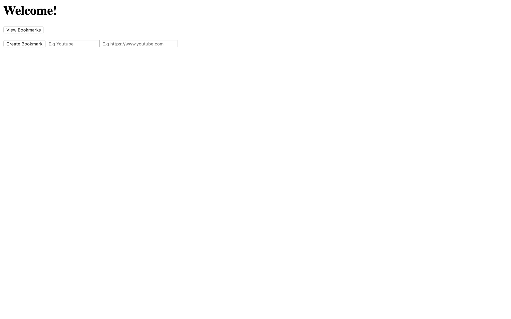
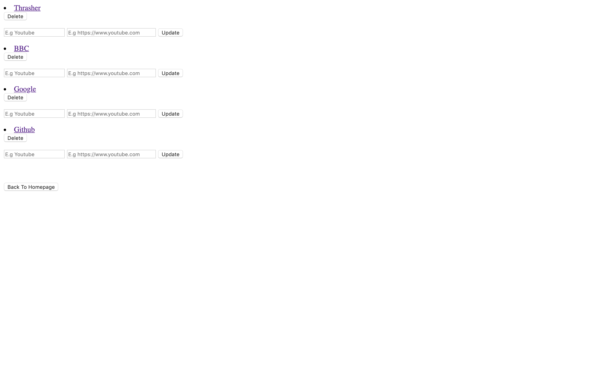

# Bookmark Manager

Week 4 Afternoon Challenge at Makers. This was a collaborative exercise, pairing every day with a different member of the cohort. The objectives of the week were to intergrate databases into a web app to store the state of the program. The app is meant to be able to `Create`, `Review`, `Update` and `Destroy` a user-inputted bookmark. The app followed the `MVC` structure, `RESTful` API, and good `Test Driven Development`.

Although the styling on the app is basic, the functionality is solid, and very efficient. All bokmarks added can be stored in the database. The database logic has been refactored into its own class, as has the CRUD logic, showing encapsulation, SRP and DRY code, all being Test Driven using `RSpec` + `Capybara`.

**The functionality of the app:**

- A user can view all exisiting bookmarks in the database
- A user can add a bookmark to the database
- A user can update the bookmark (name and link) from the database
- A user can delete the bookmark from the database

---

## How to Run

Clone this repo, and in the command line navigate to this directory. In the command line type in:

```
bundle install
```

Once the dependancies are installed, type in the command line:

```
psql
```

This will open up psql. From here you can create the Database by typing in the command line:

```
CREATE DATABASE bookmark-manager
```

Then connect to this Database by typing in the command line:

```
\c bookmark-manager;
```

You will then be able to create the tables necessary for the 'bookmarks' to be stored in. Open up the [_db/migrations_](/db/migrations) folder, you will see the following 2 files:

```
01_create_bookmarks_table.sql
02_add_title_to_bookmarks.sql

```

Paste the commands into the 'bookmark-manager' Database you have just created via psql in the command line. The Tables will then be created. To launch the app locally, in the command line type:

```
rackup
```

Then visit [_localhost:9292_](http://localhost:9292/) in the browser.

To run the test suite (RSpec and Capybara), in the command line type:

```
rspec
```

This will display 11 passing tests with 100% coverage. These tests will run on the Test Environment, another `bookmark-manager-test' Database will need to be set up with the same tables in order to run the tests.

---

### Homepage/Add Bookmarks



---

### View/Delete/Update Bookmarks


